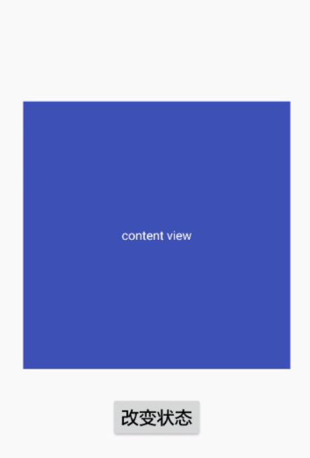
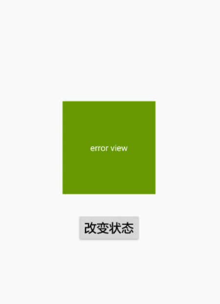
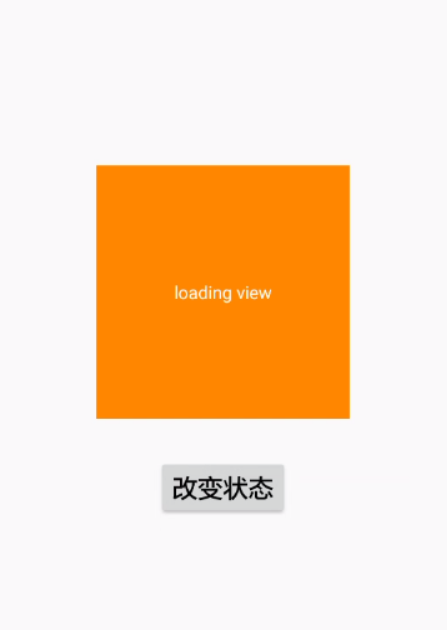
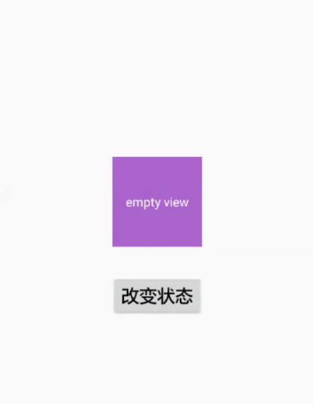

# CustomViewGroup
自定义ViewGroup实践

### 一、 浮动布局FlowLayout
根据子view的宽高，动态布局子view在控件中的位置

### 二、 状态切换布局StateSwitchLayout：
可自由切换conten/error/loading/empty的布局文件或者view，该控件采用懒加载的模式，即只有调用showXXXX方法才会add到该控件中，完全不必担心加载卡顿的问题
#### 1.content

#### 2.error

#### 3.loading

#### 4.empty
